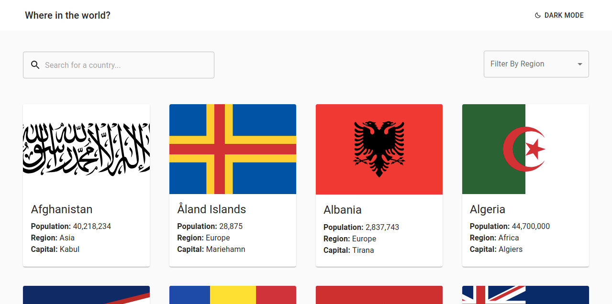
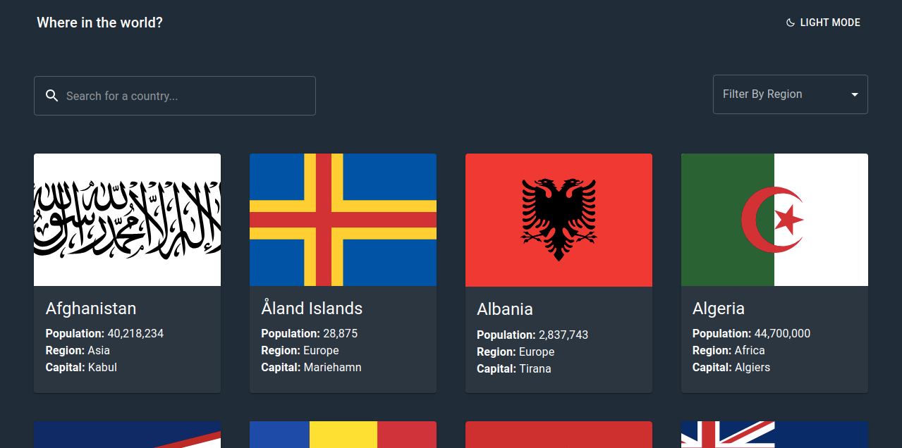

# REST Countries API with color theme switcher

This is a solution to the [REST Countries API with color theme switcher challenge on Frontend Mentor](https://www.frontendmentor.io/challenges/rest-countries-api-with-color-theme-switcher-5cacc469fec04111f7b848ca).

## Links 🔗

- Solution URL: [Repository](https://github.com/lowesilvan/REST-Countries-API-with-color-theme-switcher-Challenge)
- Live Site URL: [GitHub Pages](https://lowesilvan.github.io/REST-Countries-API-with-color-theme-switcher-Challenge/)

## The challenge 💻

Users should be able to:

- See all countries from the API on the homepage.
- Search for a country using an `input` field.
- Filter countries by region.
- Click on a country to see more detailed information on a separate page.
- Click through to the border countries on the detail page.
- Toggle the color scheme between light and dark mode.

### Screenshot


<br>



### Built with

- [Material UI](https://mui.com) - UI Library.
- Flexbox and Grid.
- Desktop-first workflow.
- [React](https://reactjs.org) - JS library.
- [React Router](https://reactrouter.com) - React library

### Future Improvements

- Set timeout for the search field to reduce number of api calls
- Restructure state management to accomodate for border country links

### More about me

- Frontend Mentor - [@lowesilvan](https://www.frontendmentor.io/profile/lowesilvan)
- Twitter - [@dt_lowe](https://www.twitter.com/ashiqfury)

```
